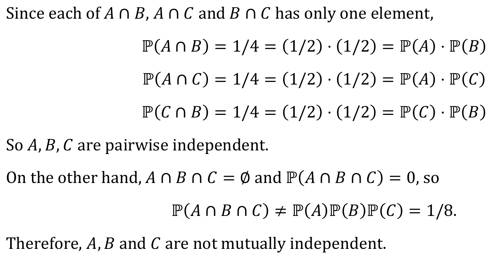
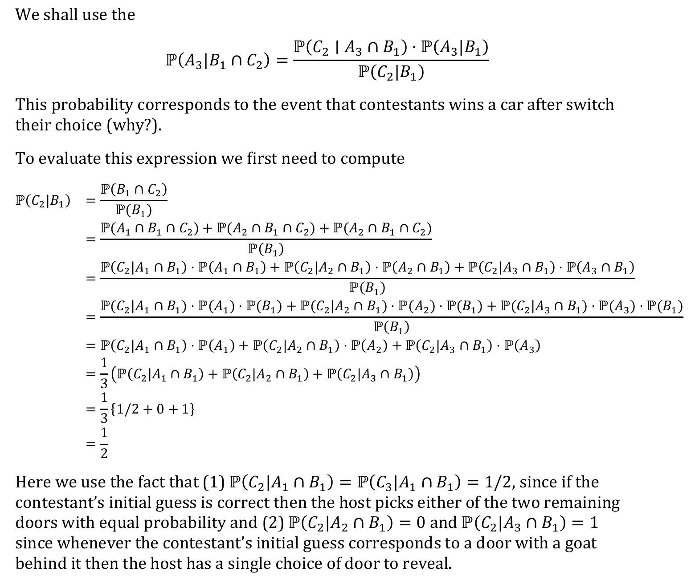
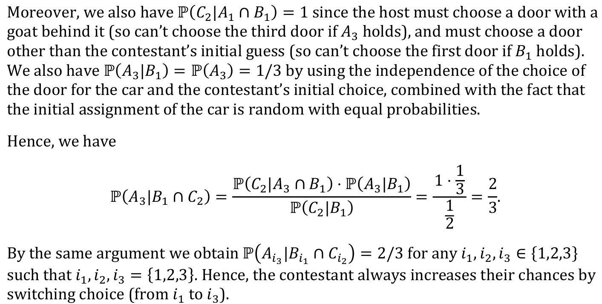

```{r setup, include=FALSE}
knitr::opts_chunk$set(echo = TRUE)
```

### Load packages
```{r}
library(tidyverse)
```


## 1. Tidy data and iteration 

### 1.1 (Q1)

```{r}
library(purrr)
```


### 1.1 (Q2)

```{r}
impute_by_median<-function(x){
 mu<-median(x,na.rm=TRUE) # first compute the mean of x
 impute_f<-function(z){ # coordinate-wise imputation
 if(is.na(z)){
 return(mu) # if z is na replace with mean
 }else{
 return(z) # otherwise leave in place
 }
 }
return(map_dbl(x,impute_f)) # apply the map function to impute across 
vector
}


v<-c(1,2,NA,4)
impute_by_median(v)
```

### 1.1 (Q3)

```{r}
x_start <- 0
x_end <- 10
x <- seq(from = x_start, to = x_end, by = 0.1)
y <- 5 * x + 1
df_xy <- data.frame(x = x, y = y)

df_xy%>%head(5)
```

### 1.1 (Q4)

```{r}
df_xy %>% mutate(z=map2_dbl(x,y,~.x+.y)) %>% head(5)

sometimes_missing<-function(index,value){
 if(index%%5==0){
   return(NA)
 }else{
   return(value)
  }
 }

sometimes_missing(14,25)
sometimes_missing(15,25)

df_xy_missing <- df_xy %>% mutate(y=map2_dbl(row_number(),y,sometimes_missing))

df_xy_missing %>% head(10) 
```

### 1.1 (Q5)

```{r}
df_xy_imputed <- df_xy_missing %>% mutate(y=impute_by_median(y))
head(df_xy_imputed)
```

### 1.2 (Q1)

```{r}
library(readxl)
folder_path <- "C:\\Users\\levit\\Downloads\\"
file_name <- "HockeyLeague.xlsx"
file_path <- paste(folder_path,file_name,sep="")
wins_data_frame <- read_excel(file_path,sheet="Wins")
wins_data_frame %>% select(1:5)%>% head(3)
```

```{r}
w_l_narrow<-function(w_or_l){ 
return( 
read_excel(file_path,sheet=w_or_l)%>% 
rename(Team=...1)%>%   #第一列命名为Team,原始数据无列名
pivot_longer(!Team,names_to="Year",values_to="val")%>% ##除Team列的其他列, 列名存入Year, 值存入val
mutate(Year=as.integer(Year))%>% 
separate(col=val,into=c(w_or_l,"Total"),sep=" of ",convert=TRUE) 
) 
} 
wins_tidy<-w_l_narrow(w_or_l="Wins") 
wins_tidy %>% dim()
wins_tidy%>%head(5)
```

### 1.2 (Q2)

```{r}
losses_tidy<-w_l_narrow(w_or_l="Losses") 
losses_tidy %>% head(5)
```

### 1.2 (Q3)

```{r}
hockey_df <- inner_join(wins_tidy,losses_tidy)%>%mutate(Draws=Total-Wins-Losses)%>%mutate(Wins_rt=Wins/Total)%>%mutate(Losses_rt=Losses/Total)%>%mutate(Draws_rt=Draws/Total)
hockey_df %>% head(5)

#下面这种写法更优雅

#hockey_df<-inner_join(wins_tidy,losses_tidy)%>%
  #mutate(Draws=Total-Wins-Losses)%>% 
  #mutate(across(starts_with(c("Wins","Losses","Draws")),~.x/Total, .names="{.col}_rt")) 
#hockey_df %>% head(5)
```

### 1.2 (Q4)

```{r}

hockey_df %>%
  select(-Wins,-Draws,-Losses) %>% 
  group_by(Team) %>% 
  summarise(across(c("Wins_rt","Losses_rt","Draws_rt"), 
                   list(md=median,mn=mean), 
                   .names="{substring(.col,1,1)}_{.fn}")) %>% 
  arrange(desc(W_md))
```


### 1.3 (Q1)

```{r}
num_red_balls<-3 
num_blue_balls<-7 
total_draws<-22 
prob_red_spheres<-function(z){ 
  total_balls<-num_red_balls+num_blue_balls 
  log_prob<-log(choose(total_draws,z))+ 
    z*log(num_red_balls/total_balls)+(total_draws-z)*log(num_blue_balls
 /total_balls) 
  return(exp(log_prob)) 
} 
 
num_trials<-1000 # set the number of trials 
set.seed(0) # set the random seed 
 
num_reds_in_simulation <- data.frame(trial=1:num_trials) %>% mutate(sample_balls = map(.x=trial, ~sample(10,22, replace = TRUE))) %>%  mutate(num_reds = map_dbl( .x=sample_balls, ~sum(.x<=3) ) ) %>%  pull(num_reds)  
 
prob_by_num_reds <- data.frame(num_reds=seq(22)) %>%  
  mutate(TheoreticalProbability=prob_red_spheres(num_reds)) %>% mutate(EstimatedProbability=map_dbl(.x=num_reds,~sum(num_reds_in_simulation==.x))/num_trials) 
```

### 1.3 (Q2)

```{r}
prob_by_num_reds %>%pivot_longer(cols=c("EstimatedProbability","TheoreticalProbability"),names_to="Type",values_to="count") %>% ggplot(aes(num_reds,count)) +  
  geom_line(aes(linetype=Type, color=Type)) + geom_point(aes(color=Type
 )) + scale_linetype_manual(values = c("solid", "dashed"))+ theme_bw() + xlab("Number of reds") + ylab("Probabilities")
```
## 2. Bayes theorem 

### 2.1 (Q1)

```{r}
p_A<-0.9 
p_B_given_A<-0.8 
p_not_B_given_not_A<-0.75 
p_B<-p_B_given_A*p_A+(1-p_not_B_given_not_A)*(1-p_A) 
p_A_given_B<-p_B_given_A*p_A/p_B 
p_A_given_B 
```

### 2.2 (Q1)

#### 1

$P(A|B)=1$

#### 2

$P(A|B)=0$

Note that this also holds for the case ℙ(𝐴 ∩ 𝐵) = 0

#### 3

$P(A|B)=1$

#### 4

$P(A|\Omega)=\frac{P(A\cap \Omega)}{P(\Omega)} =\frac{P(A)}{1}=P(A) $

#### 5

$P(A\cap B\cap C)=P(A|B\cap C)\cdot P(B\cap C)=P(A|B\cap C)\cdot P(B|C)\cdot P(C)$

$P(A\cap B\cap C)=P(B\cap A\cap C)=P(B|A\cap C)\cdot P(A\cap C)=P(B|A\cap C)\cdot P(A|C)\cdot P(C)$

#### 6

According to question 5:
$\frac{P(B|A\cap C)\cdot P(A|C)}{P(B|C)} =\frac{P(A\cap B\cap C)}{P(C)} \cdot \frac{1}{P(B|C)}= \frac{P(A\cap B\cap C)}{P(C)} \cdot \frac{P(C) \cdot P(A|B \cap C)}{P(A\cap B\cap C)}=P(A|B \cap C)$

### 2.2 (Q2)

$0.7 \cdot 0.2+0.9 \cdot 0.8=0.86$


### 2.3 (Q1)

$P(A)+P(B)+P(C)= \frac{1}{2}$


### 2.4 (Q1)

{width=50%}
{width=50%}
### 2.4 (Q2)

```{r}
n <- 5000 
df <- data.frame( door_for_car = sample(3, n, replace=TRUE),  
                  initial_door_chosen_by_contestant = sample(3, n, replace=TRUE)) 
 
host_selection <- function(door_car, door_contestant){  
  # door_car, door_contestant are two numbers 
  if(door_car!=door_contestant){ 
    # choose the other door which reveals a  a goat.  
    return (6-door_car-door_contestant)  
  } else { 
    # choose one of the other two doors 
    i <- sample(2,1) 
    if (door_car==1) return (i+1) 
    if (door_car==3) return (i) 
    if (door_car==2){ 
      if (i==1){ return (1) } 
      if (i==2){ return (3) } 
    } 
  } 
} 
 
df <- df %>% mutate( 
  door_chosen_by_host=map2_dbl(door_for_car, initial_door_chosen_by_contestant, host_selection), 
  door_after_switching=6-initial_door_chosen_by_contestant-door_chosen_by_host ) 
 
# probability of wining a car with initial choice 
prob_wins_initial <- mean(df$initial_door_chosen_by_contestant==df$door_for_car) 
# probability of wining a car after switching 
prob_wins_switch <- mean(df$door_after_switching==df$door_for_car) 
prob_wins_initial
prob_wins_switch
```


